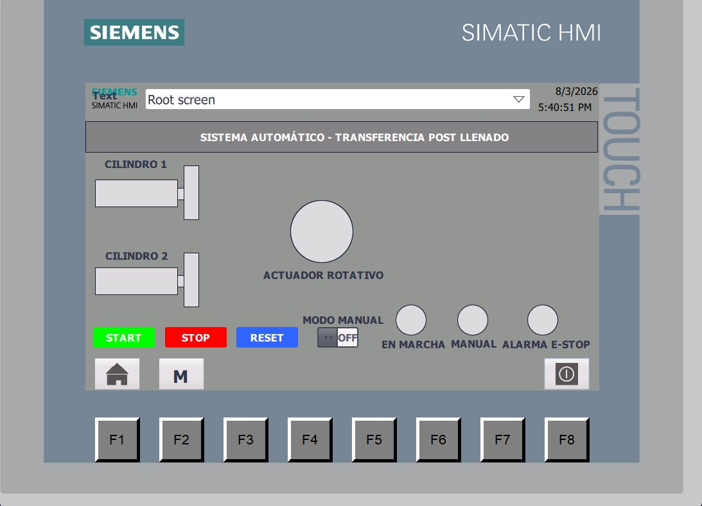
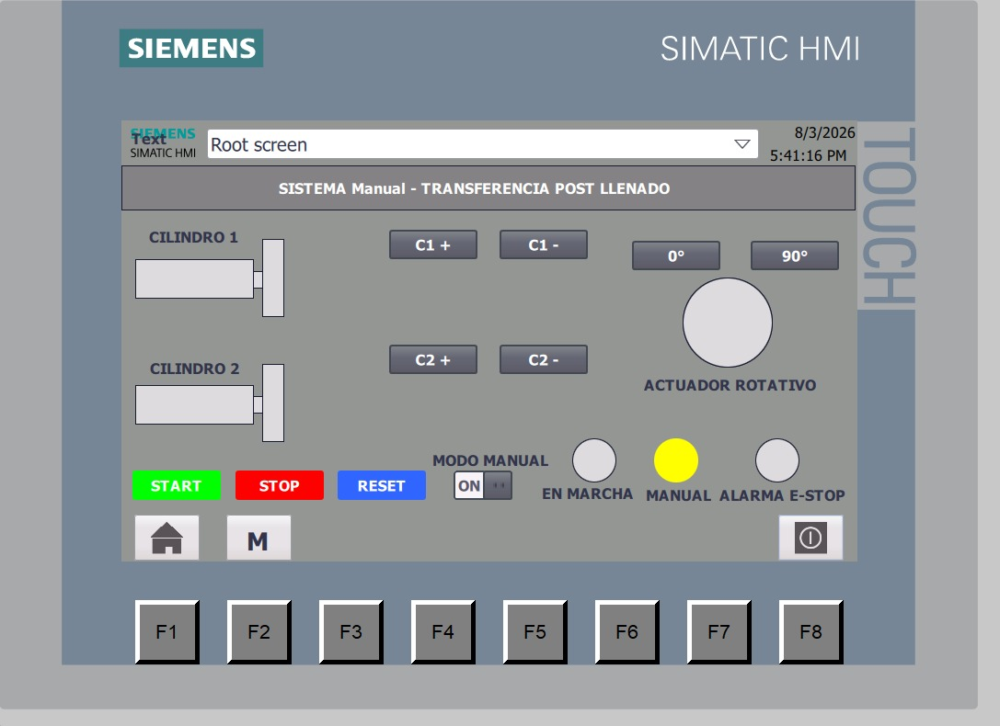

# Automatizacion-del-sistema-de-tranferencia-post-llenado
# Automatización de Línea de Producción de Gelatina

Este repositorio contiene la lógica de control y el respaldo de la interfaz HMI para el proyecto de grado enfocado en la automatización de una línea de producción de gelatina, incluyendo el control de los actuadores neumaticos. El sistema está diseñado sobre un controlador principal Siemens SIMATIC S7-1200.

> **Nota:** El sistema se controla íntegramente de manera local mediante el panel HMI principal. Este diseño no incluye implementación de arquitectura SCADA.

## Estructura del Proyecto

El código está estructurado en TIA Portal de la siguiente manera:

*   **Main (OB1):** Bloque de organización cíclico principal.
*   **Secuencia Automática (FC1):** Lógica del ciclo de trabajo continuo.
*   **Control Manual (FC2):** Activación manual de actuadores para mantenimiento y pruebas.
*   **DB_alarmas (DB3):** Registro y estado de los fallos del sistema.
*   **DB_manual (DB4):** Variables de estado para operaciones manuales.

---

## Interfaz HMI (Panel TP1200 Comfort)

El control y monitoreo del proceso se realiza a través de 2 pantallas principales operadas localmente.

### Pantalla Principal (Operación)

*Monitoreo general de la producción, visualización de contadores de bolsas e indicadores del estado del ciclo (Automático/Manual).*

### Pantalla de Mantenimiento

*Panel técnico para forzado de actuadores, gestión de tiempos neumáticos y reseteo de turnos o alarmas.*

---

## Diagramas LADDER (PDF)

Debido a que los archivos fuente están estructurados para el control de versiones, puedes visualizar los diagramas de contactos (LADDER) directamente en los siguientes documentos generados desde TIA Portal:

*   [📘 Ver Diagrama OB1 - Main](./Imagenes/Main_OB1.pdf)
*   [📘 Ver Diagrama FC1 - Secuencia Automática](./Imagenes/Secuencia_automatica_FC1.pdf)
*   [📘 Ver Diagrama FC2 - Control Manual](./Imagenes/Control_manual_FC2.pdf)

---

## Archivos de Respaldo

En el archivo `Proyecto automatizacion.zap20` se encuentra el archivo `.zap` que contiene la configuración completa del hardware (PLC S7-1200 + HMI TP1200 Comfort) y el proyecto original de TIA Portal para su restauración y ejecución en PLCSIM.
